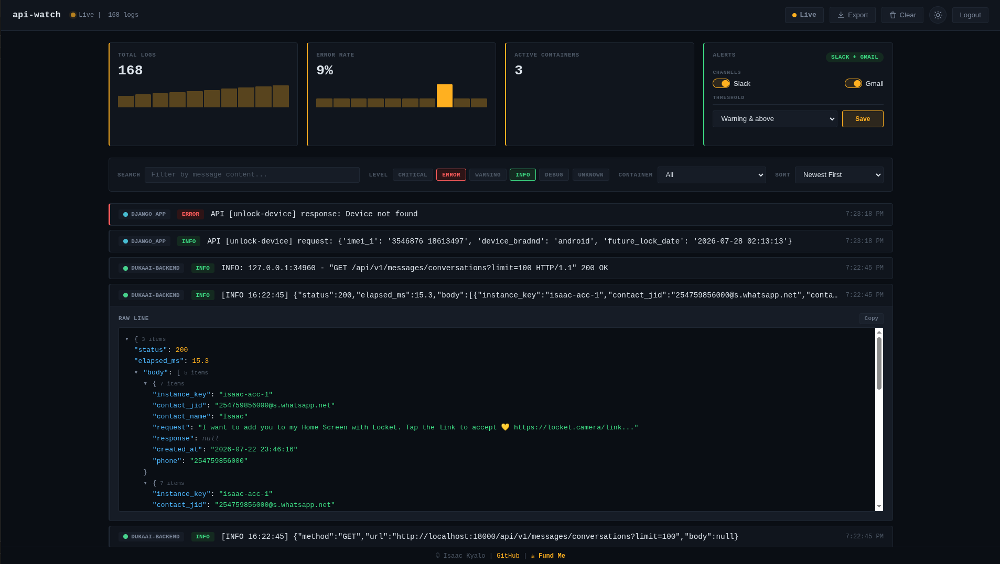

# api-watch

**Stop grepping `docker logs`. Stop standing up Grafana + Loki for a five-person team.**

One container. No Redis, no log-shipping agent, no config sprawl. Point it at your Docker socket, get a live, searchable, alerting dashboard in under a minute.


---

## Why api-watch?

Grafana + Loki is the right tool once you've outgrown a single box. Until then, it's a lot of infrastructure to stand up just to read logs.

api-watch sits in between:

- **Persistent logs.** SQLite-backed storage with configurable retention that survives restarts.
- **One container.** No Redis, Postgres, or log shipping pipeline.
- **Readable JSON.** Expand structured logs into a syntax-highlighted tree.
- **Built-in alerts.** Slack and Gmail notifications with cooldowns.
- **Made for small teams.** If you need SSO, clustering or multi-host aggregation, you've probably outgrown api-watch and that's okay.

---

## Features

- Live container log streaming over WebSockets
- Persistent log history
- Full-text server-side search
- JSON log parsing with expandable tree view
- Filter by container and severity
- Slack & Gmail alerts
- Session authentication
- Automatic log retention
- Export logs to JSON
- Label-based container discovery
- Dark & light themes

---

## Dashboard



---

## Quickstart

```bash
docker run -d \
  --name api-watch \
  --restart unless-stopped \
  -p 22222:22222 \
  -e WATCHDOG_USERNAME=admin \
  -e WATCHDOG_PASSWORD=changeme \
  -v ./apiwatch-data:/app/data \
  -v /var/run/docker.sock:/var/run/docker.sock \
  theisaac/api-watch:latest
```

Open

```
http://localhost:22222
```

Log in and you're ready.

By default api-watch only watches containers with:

```bash
--label apiwatch.collect=true
```

Example:

```bash
docker run -d \
  --label apiwatch.collect=true \
  myapp:latest
```

---

## docker-compose

```yaml
services:
  apiwatch:
    image: theisaac/api-watch:latest
    restart: unless-stopped
    ports:
      - "22222:22222"
    environment:
      - WATCHDOG_USERNAME=${WATCHDOG_USERNAME}
      - WATCHDOG_PASSWORD=${WATCHDOG_PASSWORD}
    volumes:
      - ./apiwatch-data:/app/data
      - /var/run/docker.sock:/var/run/docker.sock
```

---

## Example application

```yaml
services:
  backend:
    image: registry.gitlab.com/org/backend:latest
    labels:
      - "apiwatch.collect=true"
```

---

## Why not Dozzle or Loki?

| Feature | api-watch | Dozzle | Grafana + Loki |
|----------|:---------:|:------:|:--------------:|
| Live logs | ✅ | ✅ | ✅ |
| Persistent history | ✅ | ❌ | ✅ |
| Search history | ✅ | Limited | ✅ |
| JSON viewer | ✅ | Basic | ✅ |
| Slack/Gmail alerts | ✅ | ❌ | ✅ |
| SQLite | ✅ | ❌ | ❌ |
| One-container setup | ✅ | ✅ | ❌ |
| Enterprise scale | ❌ | ❌ | ✅ |

If you only need live logs with history, **api-watch is the excellent choice**.

If you're running a large fleet of servers or Kubernetes clusters, **Grafana + Loki** is the right solution.

api-watch is for everyone in between.

---

## Configuration

| Variable | Default |
|---|---|
| `WATCHDOG_USERNAME` | `admin` |
| `WATCHDOG_PASSWORD` | `password` |
| `API_WATCH_DASHBOARD_HOST` | `0.0.0.0` |
| `API_WATCH_DASHBOARD_PORT` | `22222` |
| `APIWATCH_COLLECT_LABEL` | `apiwatch.collect=true` |
| `APIWATCH_WATCH_ALL` | `false` |
| `APIWATCH_EXCLUDE` | — |
| `APIWATCH_LOG_LEVELS` | all |
| `APIWATCH_RETENTION_HOURS` | `72` |
| `APIWATCH_SESSION_TTL_SECONDS` | `86400` |
| `APIWATCH_SLACK_WEBHOOK_URL` | — |
| `APIWATCH_GMAIL_USER` | — |
| `APIWATCH_GMAIL_APP_PASSWORD` | — |
| `APIWATCH_ALERT_EMAIL_TO` | same as Gmail |
| `APIWATCH_ALERT_COOLDOWN_SECONDS` | `300` |
| `APIWATCH_PUBLIC_URL` | — |

See `.env.example` for descriptions and examples.

---

## Data retention

Logs are stored in SQLite under `/app/data`.

Mount a volume to preserve history across restarts.

Old logs are automatically removed according to `APIWATCH_RETENTION_HOURS`.

---

## Limitations

api-watch intentionally focuses on single-host Docker deployments.

It does **not** provide:

- Multi-host aggregation
- Kubernetes support
- SSO
- Per-user accounts
- Distributed log storage

If you need those features, Grafana + Loki is a better fit.

---

## Contributing

Issues and pull requests are welcome.

api-watch started as an internal tool for a small startup. Feedback from other teams is what drives the roadmap.


---

## License

MIT

---

## Support

If api-watch saved you time, ⭐ star the repository to help others discover it.

Want to support development? Buy me a coffee on [Ko-fi](https://ko-fi.com/isaackyalo).
