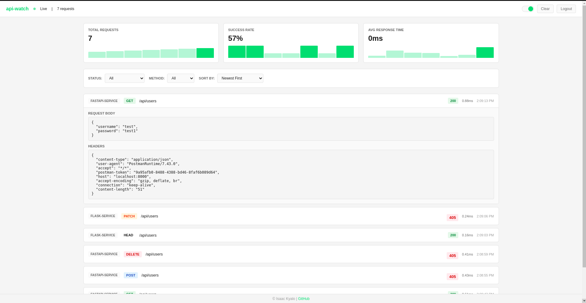

# api-watch

**Real-time API monitoring for Flask/FastAPI with zero-blocking async logging**

[](https://badge.fury.io/py/api-watch)
[](https://www.python.org/downloads/)
[](https://opensource.org/licenses/MIT)

A lightweight, developer-focused tool that streams your API requests, responses, and metadata to a beautiful real-time dashboard. Perfect for debugging, development, and understanding your API traffic.

<!--  -->


---

## Features

- **Zero Performance Impact** - Fire-and-forget async logging that never blocks your API
- **Real-time Streaming** - WebSocket-powered dashboard shows requests as they happen
- **Auto-Start Dashboard** - Just import and use, dashboard starts automatically
- **Full Visibility** - Method, path, status, timing, headers, request/response data
- **Filter by Status** - Quickly filter requests by status code
- **Request Statistics** - Visual metrics and charts
- **Minimal UI** - Clean, fast dashboard focused on what matters
- **Multi-Framework** - Works with Flask and FastAPI
- **Production Ready** - Standalone mode for Docker/Kubernetes
- **Optimized Dependencies** - Only install what you need

---

## Quick Start

### Installation

**For Flask:**
```bash
pip install api-watch[flask]
```

**For FastAPI:**
```bash
pip install api-watch[fastapi]
```

**For both:**
```bash
pip install api-watch[all]
```

### Flask Integration (Auto-Start)

```python
from flask import Flask
from apiwatch import ApiWatcher
from apiwatch.middleware_flask import FlaskWatchMiddleware

app = Flask(__name__)

# Dashboard auto-starts
api_watcher = ApiWatcher(service_name='my-flask-app')
FlaskWatchMiddleware(app, api_watcher)

@app.route('/api/health', methods=['GET'])
def health():
    return jsonify({
        "status": "healthy",
        "service": "flask-service"
    })

if __name__ == '__main__':
    app.run(port=5000)
```

**Terminal run:**
```bash
python -m apiwatch
```

**Docker run: easiest**
```bash
docker pull theisaac/api-watch:latest
docker compose up -d 
```

**Open dashboard:**
```
http://localhost:22222
```

---

### FastAPI Integration

```python
from fastapi import FastAPI
from pydantic import BaseModel
from apiwatch import ApiWatcher
from apiwatch.middleware_fastapi import FastAPIWatchMiddleware

app = FastAPI()

api_watcher = ApiWatcher(
    service_name='fastapi-service',
    dashboard_host='localhost',
    auto_start_dashboard=False
)

app.add_middleware(FastAPIWatchMiddleware, watcher=api_watcher)

@app.get("/api/health")
async def health():
    return {
        "status": "healthy",
        "service": "fastapi-service"
    }

if __name__ == '__main__':
    import uvicorn
    uvicorn.run(app, host="0.0.0.0", port=8000)
```

**Run it:**
```bash
uvicorn app:app --port 8000
```

---

## 📊 Dashboard Features

### Real-time Request Monitoring
- ✅ Live streaming of API requests
- ✅ Color-coded HTTP methods (GET, POST, PUT, DELETE)
- ✅ Status code highlighting (success/error)
- ✅ Response time tracking
- ✅ Service name badges (multi-service support)

### Filters & Search
- Filter by status code (2xx, 3xx, 4xx, 5xx, All)
- Sort by newest, oldest, fastest, sloweset, status(high-low)
- Filter by HTTP method

### Request Details
- Full request/response bodies
- Query parameters
- Headers (sensitive headers filtered)
- Timestamp and duration

---

## Use Cases

### Development & Debugging
```python
# See exactly what's hitting your API in real-time
# No more print() debugging!
```

### API Testing
```python
# Watch your integration tests run
# Verify request/response data instantly
```

### Microservices Monitoring
```python
# Monitor traffic between multiple services
# Debug complex request flows
```

---

## Configuration

### Basic Options

```python
api_watcher = ApiWatcher(
    service_name='my-app',           # Service identifier
    max_history=1000,                # Requests to keep in memory
    dashboard_host='localhost',      # Dashboard host
    dashboard_port=22222,            # Dashboard port
    auto_start_dashboard=True        # Auto-start if not running
)
```

### Middleware Options

**Flask:**
```python
FlaskWatchMiddleware(
    app, 
    api_watcher,
    capture_request_body=True,   # Log request bodies
    capture_response_body=True   # Log response bodies
)
```

**FastAPI:**
```python
app.add_middleware(
    FastAPIWatchMiddleware,
    watcher=api_watcher,
    capture_request_body=True,   # Log request bodies
    capture_response_body=True   # Log response bodies
)
```

---

## Production Deployment

### Standalone Mode

For production, run the dashboard as a separate service:

**Terminal 1: Start Dashboard**
```bash
python -m apiwatch
```

**Terminal 2: Start Your App**
```python
from apiwatch import ApiWatcher

api_watcher = ApiWatcher(
    service_name='my-app',
    auto_start_dashboard=False  # Don't auto-start in production
)
```

### Docker Compose

```yaml
services:
  apiwatch:
    image: theisaac/api-watch:latest
    container_name: apiwatch
    networks: 
     - test-network
    ports:
      - "22222:22222"
    restart: unless-stopped
    environment:
      - PYTHONUNBUFFERED=1
      - WATCHDOG_USERNAME=admin
      - WATCHDOG_PASSWORD=admin
      - API_WATCH_DASHBOARD_HOST=0.0.0.
      - API_WATCH_DASHBOARD_PORT=22222
    command: python -m apiwatch

```

```yaml
services:
  test_flask_app:
    image: theisaac/files-webapp:latest
    restart: always
    networks:
      - test-network
    environment:
      - API_WATCH_MAX_HISTORY=3000
      - API_WATCH_DASHBOARD_HOST=apiwatch
      - API_WATCH_DASHBOARD_PORT=22222
      - API_WATCH_AUTO_START=false 
    ports:
      - 1515:1515

#### NOTE
In Dockerized applications, ensure that the **apiwatch** container and your **Flask/FastAPI** containers are on the same network.  
Also, use the container name `apiwatch` as the host name in your Flask app.


**Service code:**
```python
import os
from apiwatch import ApiWatcher

api_watcher = ApiWatcher(
    service_name=os.getenv('SERVICE_NAME', 'api-service'),
    dashboard_host=os.getenv('WATCHDOG_HOST', 'localhost'),
    dashboard_port=int(os.getenv('WATCHDOG_PORT', 22222)),
    auto_start_dashboard=False
)
```

---

## How It Works

```
Flask/FastAPI Request
        ↓
   Middleware intercepts
        ↓
   Queue.put_nowait() (non-blocking, <0.1ms)
        ↓
   App continues normally
        ↓
Background Async Worker
        ↓
HTTP POST to Dashboard
        ↓
Dashboard broadcasts via WebSocket
        ↓
Browser UI updates in real-time
```

**Zero blocking!** Your API never waits for logging.

---

## Requirements

- Python 3.7+
- aiohttp 3.8+ (always required)
- Flask 2.0+ (optional - only for Flask integration)
- FastAPI 0.68+ & Starlette 0.14+ (optional - only for FastAPI integration)

---